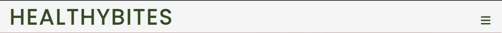

# HealthyBites
Welcome to HealthyBites, your go-to platform for delicious and nutritious recipes that promote a healthy lifestyle. 
Our goal is to make healthy eating simple, enjoyable, and accessible to everyone.

[See deployed website](https://saretta1194.github.io/HealthyBites/index.html)

## Table of content

- [Project Overview](#project-overview)
- [Design and User Experience](#design-and-user-experience)
  - [Design](#design)
  - [Layout](#layout)
    - [Navbar and Footer](#navbar-and-footer)
    - [Home Page](#home-page)
    - [Recipes Page](#recipes-page)
    - [About Page](#about-page)
    - [Performance](#performance)
- [Deployment](#deployment)
  - [Live Website](#live-website)
- [Testing](#testing)
  - [Tests](#tests)
  - [Fixed Bugs](#fixed-bugs)
  - [Validator Testing](#validator-testing)
- [Credits](#credits)
  - [Content](#content)
  - [Media](#media)
- [Technologies Used](#technologies-used)

---

## Project Overview

**HealthyBites** is a website designed to promote healthy eating habits by offering nutritious recipes, meal planning tips, and general well-being advice. The goal is to educate users on how to make better food choices and maintain a balanced diet.

---

## Design and User Experience

### Design
The website follows a clean and modern aesthetic, with a focus on usability and accessibility. A soft color palette and visually appealing images create a welcoming environment.
I used Poppins and Roboto for the fonts.

## Layout

There are three pages: Home page, Recipes and About.
In each page we have a responsive navbar on top and a footer with social media links and a coopyright section.

## Navbar and Footer

Navbar and footer change layout depending on the size of the screen

 All the navigation items are visible on larger screen (769px and up), while they are hidden in a colapsing navbar on smaller screens (768px and down).

  - The colapsing navbar has an hamburger menu icon  when it's closed, and an x symbol when it's open.

 The footer contains:
 - copyrights
 - social media links

 When clicking on the social links, this gone open in a new tab.

#### Home Page

- __Hero-Image__

  - This is the landing page for our users, so it has an eye-catching hero image to grab their attention.
  - The Hero Image contains the principal message from the page,an introduction to healthy eating and highlights key sections of the website.
- A **call-to-action (CTA)** encourages users to explore recipes and meal plans.

#### Recipes Page
- A collection of **healthy recipes** categorized for easy navigation.
- Each recipe includes ingredients, preparation steps, and nutritional information.

#### About Page
- Provides information about the mission of HealthyBites.
- Includes details about the creators or contributors and the contact form 
The following fiels are required: Name, Email and Message.

### Performance

I have tested the performance in chrome, using lighthouse.

## Deployment

### Live Website

- The site was deployed to GitHub pages. The steps to deploy are as follows:
  - In the GitHub repository, navigate to the Settings tab
  - From the Code and automation section drop-down menu, select the Pages.
  - In the build and deployment area, choose from source "deply from a branch" and after in Branch choosse the main branch and root and save.
  - Once this is save, the page will be automatically refreshed with a detailed ribbon display to indicate the successful deployment (he take me more less 5 minutsfor appear the link).

The live link can be found here - [Live Website](https://saretta1194.github.io/HealthyBites/)

## Testing

To test my website I have opened it on different devices, to see if it was working as expected.

- Browser tested:
  - Chrome
  - Firefox
  - Safari

- Operating systems:
  - Android
  - iOS
## Test

  
General

  |Action | Expected behavious | Result|
  |-------|--------------------|-------|
  |Copy url of the browser and paste it in browser. Press enter | Browser should load index.html | Pass |
  |Scale up the window | The contentent should not stretch over a certain size | Pass |
  |Scale down the window | The contentent should be visible without having to scroll horizontally | Pass |
  |Scale down under 840px width | The layout should switch from 2 to 1 column | Pass |

  

  

  
Navigation

  |Action | Expected behavious | Result|
  |-------|--------------------|-------|
  |Scale down under 769px width | The top navigation bar should collapse into hamburger navbar | Pass |

  

  

  
Footer

  |Action | Expected behavious | Result|
  |-------|--------------------|-------|
  |Click on the Twitter icon in the footer | It should open Twitter in a new tab | Pass |
  |Click on the Instagram icon in the footer | It should open Instagram in a new tab | Pass |
  |Click on the Facebook icon in the footer | It should open Facebook in a new tab | Pass |
  |Click on the Youtub icon in the footer | It should open Youtube in a new tab | Pass |

  

  

  
Form

  |Action | Expected behavious | Result|
  |-------|--------------------|-------|
  |Submit the form without any value | Browser should inform me that "Name" is a required field | Pass |
  |Submit the form without email address | Browser should inform me that "Email" is a required field | Pass |
  |Submit the form with invalid email address | Browser should inform me that "Email" field must be of email format | Pass |

  

### Validator Testing

- HTML
  - No errors were returned when passing the final version through the official [W3C validator](https://validator.w3.org/nu/#textarea)

- CSS
  - No errors were found when passing the final version through the official [(Jigsaw) validator](https://jigsaw.w3.org/css-validator/validator)
  
  

  ## Credits

  - Some part's of the code its taken (lerned) from the LovingRun project.
  - The icons in the footer were taken from [Font Awesome](https://fontawesome.com/)
  - The :root code in css for simplify the introduction on css commands with the collors and  fonts i lerned in boardwalk-games.
  - The following fonts, used for the project, are from [Google Fonts](https://fonts.google.com/):
   - Poppins
   - Roboto

### Media

- The photos used for this website are from [Pexels](https://www.pexels.com/)

## Technologies used

- HTML
- CSS

